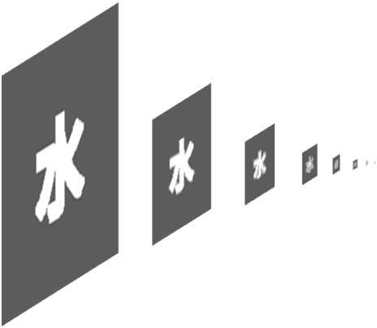
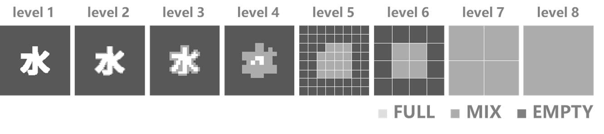
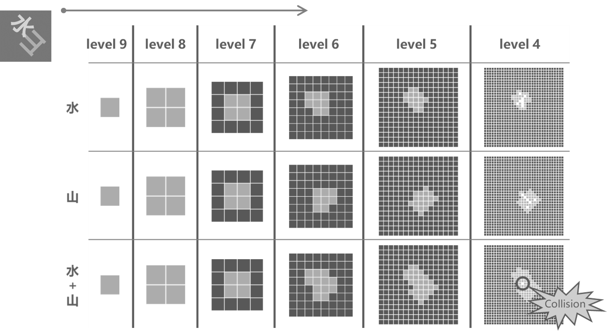

# Stuffing
[](https://github.com/guo-yong-zhi/Stuffing.jl/actions/workflows/ci.yml) [](https://github.com/guo-yong-zhi/Stuffing.jl/actions/workflows/ci-nightly.yml) [](https://codecov.io/gh/guo-yong-zhi/Stuffing.jl)  
This's an algorithm for solving **2D irregular nesting problems** (also known as cutting problems or packing problems).  
The algorithm accepts arbitrary **binary raster masks** as inputs and is good at handling the nesting problems of many gadgets. The implementation is based on Quadtree & gradient optimization. Also, it can be parallelized if you start `julia` with `julia --threads k`. This package is used by [WordCloud](https://github.com/guo-yong-zhi/WordCloud).  
Examples: [collision detection](./examples/collision.jl), [packing](./examples/packing.jl)  
Benchmark: [benchmark](https://github.com/guo-yong-zhi/WordCloud/blob/master/examples/benchmark.jl)  
***
```
▓▓▓▓▓▓▓▓▓▓▓▓▓▓▓▓▓▓▓▓▓▓▓▓▓▓▓▓▓▓▓▓▓▓▓▓▓▓▓▓▓▓▓▓▓▓▓▓▓▓▓▓
▓▓▓▓▓▓▓▓▓▓▓▓▓▓▓▓▓▓▓▒▒▒▒▒▒▒▒▒▒▒▒▒▒▓▓▓▓▓▓▓▓▓▓▓▓▓▓▓▓▓▓▓
▓▓▓▓▓▓▓▓▓▓▓▓▓▓▒▒▒▒▒░░░░░░░░░░░░░░▒▒▒▒▒▓▓▓▓▓▓▓▓▓▓▓▓▓▓
▓▓▓▓▓▓▓▓▓▓▓▓▒▒▒▒▒▒▒▒▒▒▒▒▒▒▒▒▒▒▒▒▒▒▒▒▒▒▒▒▓▓▓▓▓▓▓▓▓▓▓▓
▓▓▓▓▓▓▓▓▓▒▒▒▒▒▒▓▓▓▓▓▓▓▓▓▓▓▓▓▓▒▒▓▓▓▓▓▒▓▒░▒▒▓▓▓▓▓▓▓▓▓▓
▓▓▓▓▓▓▓▓▒▒▒▒▓▓▒▓▓▓▓▓▓▓▓▓▓▓▓▓▓▒▒▓▓▓▓▓▒▒▒▒▒▒▒▒▓▓▓▓▓▓▓▓
▓▓▓▓▓▓▒▒▒▓▓▓▓▓▒▓▓▓▓▓▓▓▓▓▓▓▓▓▓▒▒▓▓▓▓▓▒▒▒▓▓▓▒▒▒▒▓▓▓▓▓▓
▓▓▓▓▓▒▒░▒▓▓▓▓▓▒▓▓▓▓▓▓▓▓▓▓▓▓▓▓▒▒▓▓▓▓▓▒▓▒▓▓▓▒░▒▒▒▓▓▓▓▓
▓▓▓▓▒▒░░▒▓▓▓▓▓▒▓▓▓▓▓▓▓▓▓▓▓▓▓▓▒▒▓▓▓▓▓▒▓▒▓▓▓▒░▒▒▒▒▓▓▓▓
▓▓▓▒▒░░░▒▓▓▒▒▒▒▓▓▓▓▓▓▓▓▓▓▓▓▓▓▒▒▓▓▓▓▓▒▓▒▓▓▓▒░▒▒░▒▒▓▓▓
▓▓▒▒▒▒▒▒▒▓▓▒▓▒▒▓▓▓▓▓▓▓▓▓▓▓▓▓▓▒▒▒▒▒▒▒▒▒▒▓▓▓▒░▒▒░░▒▒▓▓
▓▓▒▒▒▓▓▓▓▓▓▒▓▒▒▓▓▓▓▓▓▓▓▓▓▓▓▓▓▒░▓▒▒▓▒▓▓▒▓▓▓▒░░░░░░▒▓▓
▓▒▒▒▒▓▓▓▓▓▓▒▒▒▒▓▓▓▓▓▓▓▓▓▓▓▓▓▓▒░▒▒▒▓▒▓▓▒▒▒▒▒▒▒▒▒▒▒▒▒▓
▓▒▒▒▒▓▓▓▓▓▓▓▓▓▓▓▓▓▓▓▓▓▓▓▓▓▓▓▓▒▒▒▒▒▒▒▒▒▒▒▒▒▒▓▓▓▓▓▓▓▒▓
▓▒▒░▒▓▓▓▓▓▓▓▓▓▓▓▓▓▓▓▓▓▓▓▓▓▓▓▓▒▓▓▓▓▓▓▓▓▓▓▓▓▒▓▓▓▓▓▓▓▒▓
▓▒▒░▒▓▓▓▓▓▓▓▓▓▓▓▓▓▓▓▓▓▓▓▓▓▓▓▓▒▓▓▓▓▓▓▓▓▓▓▓▓▒▓▓▓▓▓▓▓▒▓
▓▒▒▒▒▓▓▓▓▓▓▒▒▒▒▓▓▓▓▓▓▓▓▓▓▓▓▓▓▒▓▓▓▓▓▓▓▓▓▓▓▓▒▓▓▓▓▓▓▓▒▓
▓▒▓▓▒▓▓▓▓▓▓▒░░▒▓▓▓▓▓▓▓▓▓▓▓▓▓▓▒▓▓▓▓▓▓▓▓▓▓▓▓▒▓▓▓▓▓▓▓▒▓
▓▒▓▓▒▓▓▓▓▓▓▒▒▒▒▒▒▒▒▒▒▒▒▒▒▒▒▒▒▒▓▓▓▓▓▓▓▓▓▓▓▓▒▓▓▓▓▓▓▓▒▓
▓▒▒▒▒▓▓▓▓▓▓▒▒▓▓▓▒▓▓▓▓▓▓▓▓▓▓▓▒▒▓▓▓▓▓▓▓▓▓▓▓▓▒▓▓▓▓▓▓▓▒▓
▓▒░░▒▓▓▓▓▓▓▒▒▓▓▓▒▓▓▓▓▓▓▓▓▓▓▓▒▒▓▓▓▓▓▓▓▓▓▓▓▓▒▓▓▓▓▓▓▓▒▓
▓▒▒░▒▓▓▓▓▓▓▒▒▓▓▓▒▓▓▓▓▓▓▓▓▓▓▓▒▒▓▓▓▓▓▓▓▓▓▓▓▓▒▒▒▒▒▒▒▒▒▓
▓▓▒░▒▓▓▓▓▓▓▒▒▓▓▓▒▓▓▓▓▓▓▓▓▓▓▓▒▒▓▓▓▓▓▓▓▓▓▓▓▓▒▒▓▓▒░░▒▓▓
▓▓▒▒▒▓▓▓▓▓▓▒▒▓▓▓▒▓▓▓▓▓▓▓▓▓▓▓▒▒▓▓▓▓▓▓▓▓▓▓▓▓▒▒▓▓▒░▒▓▓▓
▓▓▓▒▒▒▒▒▒▒▒▒▓▓▓▓▒▓▓▓▓▓▓▓▓▓▓▓▒▒▓▓▓▓▓▓▓▓▓▓▓▓▒▒▓▓▒▒▒▓▓▓
▓▓▓▓▒▒░░▒▓▓▓▓▓▓▓▒▓▓▓▓▓▓▓▓▓▓▓▒▒▓▓▓▓▓▓▓▓▓▓▓▓▒▒▒▒▒▒▓▓▓▓
▓▓▓▓▓▒▒░▒▓▓▓▓▓▓▓▒▓▓▓▓▓▓▓▓▓▓▓▒▒▓▓▓▓▓▓▓▓▓▓▓▓▒▓▒▒▒▓▓▓▓▓
▓▓▓▓▓▓▒▒▒▓▓▓▓▓▓▓▒▓▓▓▓▓▓▓▓▓▓▓▒▒▓▓▒▒▒▒▒▒▒▒▒▒▒▒▒▒▓▓▓▓▓▓
▓▓▓▓▓▓▓▓▒▒▒▒▓▓▓▓▒▓▓▓▓▓▓▓▓▓▓▓▒▓▓▓▒▓▓▒░▒▓▒░░▒▒▓▓▓▓▓▓▓▓
▓▓▓▓▓▓▓▓▓▓▒▒▒▒▒▒▒▓▓▓▓▓▓▓▓▓▓▓▒▓▓▓▒▓▓▒░▒▓▒▒▒▓▓▓▓▓▓▓▓▓▓
▓▓▓▓▓▓▓▓▓▓▓▓▒▒▒▒▒▓▓▓▓▓▓▓▓▓▓▓▒▓▓▓▒▒▒▒░▒▒▒▓▓▓▓▓▓▓▓▓▓▓▓
▓▓▓▓▓▓▓▓▓▓▓▓▓▓▓▒▒▒▒▒▒▒▒▒▒▒▒▒▒▓▓▓▒▒▒▒▒▓▓▓▓▓▓▓▓▓▓▓▓▓▓▓
▓▓▓▓▓▓▓▓▓▓▓▓▓▓▓▓▓▓▓▒▒▒▒▒▒▒▒▒▒▒▒▒▒▓▓▓▓▓▓▓▓▓▓▓▓▓▓▓▓▓▓▓
▓▓▓▓▓▓▓▓▓▓▓▓▓▓▓▓▓▓▓▓▓▓▓▓▓▓▓▓▓▓▓▓▓▓▓▓▓▓▓▓▓▓▓▓▓▓▓▓▓▓▓▓
```
# Algorithm Description
* First, a **ternary raster pyramid** (implemented as [`AbstractStackQtree`](./src/qtrees.jl)) is built for every original binary raster mask. It consists of downsampled layers of the original mask. Each successive layer is downsampled at a scale of 2:1. In this way, the pyramid can also be seen as a set of hierarchical bounding boxes. The value of each pixel of each layer (the node of the tree) can be `FULL`, `EMPTY` or `MIX`.  


* Second, a **top-down method** ([`collision_randbfs`](./src/qtree_functions.jl)) is used to detect collision between two pyramids (trees). On the level 𝑙 and coordinates (𝑎,𝑏), if one tree's node is `FULL` and the other's is NOT `EMPTY`, then these two trees collide at (𝑙,𝑎,𝑏). However, to detect collisions between many objects, pairwise detection would be time-consuming. So, we first locate the objects in hierarchical sub-regions (implemented as a linked-quadtree [`RegionQtree`](./src/qtree_functions.jl)), and then detect the collision between objects within each sub-region and between the objects in the sub-regions and those in their ancestral regions (see [`batchcollisions_region` and `locate_core!`](./src/qtree_functions.jl)).  

* At last, each object in collision pair is moved according to the **local gradient** (calculated by [`gard2d`](./src/fit.jl)) near the collision point (𝑙,𝑎,𝑏), that is, moving the object away from `EMPTY` region. This will enlarge space between them. After moving the objects, the `AbstractStackQtree`s should be rebuilt for the next round of collision detection.  

